# Grafolana

Grafolana is a Forensic Analysis Tool for the Solana ecosystem.
It provides precise tracking and visualization of on-chain fund movements using a graph-based approach.

Designed with two core principles: simplicity and independence. Our forensic analysis tool delivers powerful transaction visualization through elegant graph interfaces and intuitive views, all without registration barriers. We leverage only native Solana RPC capabilities—no costly commercial APIs required. Maximum insight, minimum overhead.

Developed for the [Helius REDACTED hackathon](https://earn.superteam.fun/hackathon/redacted/) in the [Solana Forensic Analysis Tool Category](https://earn.superteam.fun/listing/solana-forensic-analysis-tool/)

## Table of Contents
- [Features](#features)
  - [Backend](#backend)
  - [UI Graph](#ui-graph)
  - [UI Lists](#ui-lists)
- [Guide](#guide)
  - [The Graph](#the-graph)
    - [Legend](#legend)
    - [Indicators](#indicators)
    - [Design Choices: Virtual Links & Nodes](#design-choices-virtual-links--nodes)
    - [Interacting with the Graph](#interacting-with-the-graph)
    - [Graph Controls](#graph-controls)
    - [Filters](#filters)
    - [The View System](#the-view-system)
  - [Transfers Detection](#transfers-detection)
  - [Swap Detection Mechanisms](#swap-detection-mechanisms)
  - [Price Derivation System](#price-derivation-system)
  - [Labelling Entities](#labelling-entities)
  - [Spam Detection](#spam-detection)
- [FAQ](#faq)
- [Authors](#authors)
- [Live Demo](#live-demo)
- [Setup and Deployment](#setup-and-deployment)
  - [Prerequisites](#prerequisites)
  - [SETUP DEV](#setup-dev)
    - [Backend](#backend-1)
    - [Frontend](#frontend)
  - [Deployment](#deployment)
  - [Deploying Grafolana to a Fresh Ubuntu Install](#deploying-grafolana-to-a-fresh-ubuntu-install)
- [Unit Tests & Integration Test](#unit-tests--integration-test)
- [License](#license)
- [Screenshots](#screenshots)
- [Acknowledgements](#acknowledgements)
- [Buy Me A Coffee ☕](#buy-me-a-coffee--)

## Features

### Backend
- [Creates graph based on transaction data](GrafolanaBack/domain/transaction)
- Retrieve graph data for transaction signatures
- Retrieve graph data for the last 1000 transactions of an account address
- Retrieve graph data for a block using its slot number
- Create Directed Acyclic Graph of each transaction by versioning accounts to avoid cycles and offers graphic sequential view of transfers
- Recognizes 149 different swap instructions from 62 different [DEX programs](GrafolanaBack/domain/transaction/config/dex_programs/swap_programs.py)
- Map transfers by parsing 22 different [instructions](GrafolanaBack/domain/transaction/parsers/instruction_parsers.py) from Solana's built-in programs
- Native SOL transfer inference (Ex: Pump.fun Sell operations)
- Offers [3 different graph views](GrafolanaFront/src/components/grafolio/graph/view-strategies): Transfers, Accounts and Wallets
- Stores minimum 4 years worth of SOL prices in DB for quick lookup and updates every minute
- [USD prices](GrafolanaBack/domain/prices) derivation mechanism for SPL token using swap data and Binance API for SOL prices
- Transactions Clustering algorithm that groups transactions by their graph's shape
- [Fast & Failsafe RPC transactions batching](GrafolanaBack/domain/rpc/rpc_acync_transaction_fetcher.py) using multiple RPC endpoints with loadbalancer respecting rate limits
- [Metadata retrieval system](GrafolanaBack/domain/metadata/spl_token) for SPL tokens mints
- Storage of transactions and mint metadata in Database for fast retrieval
- [Labelling system](GrafolanaBack/domain/metadata/labeling) allowing users to edit labels for any address
- Solana [System's Programs and Swap Programs Metadata](GrafolanaBack/domain/metadata/program)
- [Spam (dusting) detection system](GrafolanaBack/domain/spam) using default address blacklist in database, user can mark address as spam

### UI Graph
- Unique field for loading graph data by transaction signatures, addresses or slot number
- Add multiple addresses/transactions to the same graph
- Interactive graph UI with right click context menu actions: copy address/rename/mark as spam/fix position
- "Address Label" component allowing to show addresses and interact with them
- Expand/Collapse swaps & swap routers transfers
- Hide/Show swaps operations
- Hide/Show spam transfers
- Hide/Show fee transfers
- Hide/Show Create/Close accounts transfers
- Filters by amounts: SOL/SPL Token/USD Value
- Transactions clusters: Show specific groups of "lookalike" transactions 
- Contextual information of selected nodes/links
- Select multiple Nodes while holding CTRL key
- Drag & Fix a node position by dragging a node while holding ALT key
- Fullscreen mode

### UI Lists
- List of Transactions
- List of Accounts
- List of Transfers

## Guide
### The Graph 
#### Legend
Legend of the different colors used for drawing nodes:

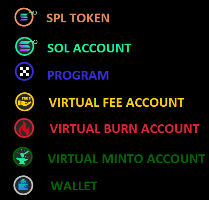

#### Indicators
Some little icons serve as indicators for some contextual node's info.
We have Signer indicator for accounts that have signed transactions.
A pool icon to showcase the swap's liquidity pools.
A stake icon for stake accounts!

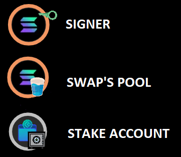

#### Design Choices: Virtual Links & Nodes
##### Swaps


When swaps are recognized by the system a virtual swap transfer representing the swap is added to the graph.
It allows to connect accounts together by this programmatic relationship.

I decided to connect the pools accounts used by the swaps as it "fills the gap" created in the flow:

User source account -> Pool 1 [GAP] Pool 2 -> User destination accounts

This is purely a technical choice to allow to link nodes and show a consolidated view of the flow and does not represent an actual transfer.

Swap will appear on the graph as a link with dotted style like the image above. Mouse hovering the swap's link will provide detailed info about the swap.

Note that you first need to expand the Swap Routers and/or Swap programs in the "General" section of the "Graph Controls" panel to be able to see the virtual swaps transfers.

##### Burn & MintTo
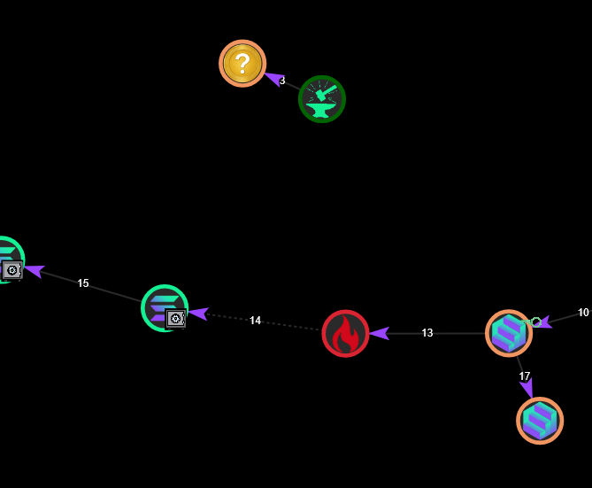

Burn & MintTo will appear as actual transfer leading or pointing to a virtual account that represents either its destination: burn or its source: mintto.

These nodes don't represent actual accounts and are just used to get a better view of what's happening while sticking to the graph's nodes/links concepts.

As detailed in the screenshot here, a virtual burn account might be used as a swap source account when the swap requires burning some token: here it's a Sanctum's PrefundWithdrawStake.

##### Fees
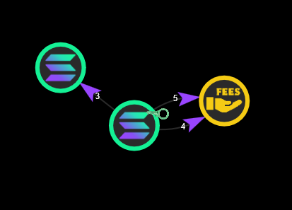

Fees paid during a transaction are shown as actual transfers, both regular and priority fees.
To be able to stay consistent with the graph Node/Link pattern I decided to create virtual Fee accounts.
Hovering a fee account will show the total fee. 
In Transfer View, each fee account is tied to a transaction and will only show total fees for that transaction.
In Accounts and Wallets Views: If multiple transactions are loaded in the graph the fee account will show the total fees of all the transactions.

#### Interacting with the Graph
There are many ways to interact with the graph with your mouse and keyboard.

##### Zoom IN/OUT
You can zoom in and out of the graph by scrolling up or down using your mouse.

##### Move the graph
Simply move the graph around by left click and drag with your mouse in the Graph's background.

##### Select Nodes/Links
You can select Nodes and Links by simply clicking on them. 
Select multiple Nodes/Links by holding your keyboard's CTRL key.

Contextual information of the selected Nodes/Links will be available in the related section within "Graph Controls".

##### Fix the position of a Node
You can fix the position of a Node by Drag&Dropping it while holding your keyboard's ALT key.
You can also fix a Node's position by right clicking on it and selecting "Fix Position"

##### Node's contextual menu
A contextual menu will offer you some options if you right click a Node.
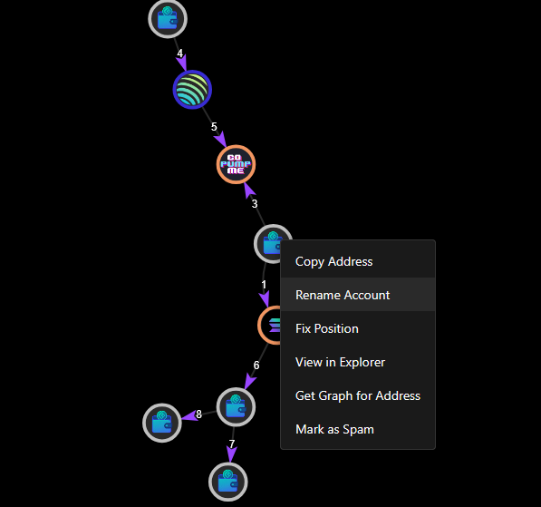

#### Graph Controls
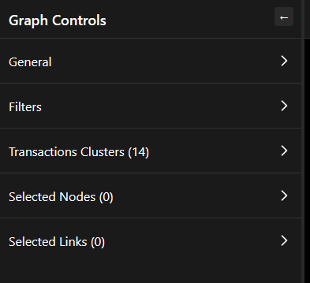

The left panel offers contextual information and some options to control the graph.

##### Information
In this section you'll be able to see the current entities that have been loaded and analyzed.
Every time you "Add" a Transaction/Address/Block to the graph, its address will show here.

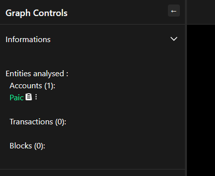

##### General Options
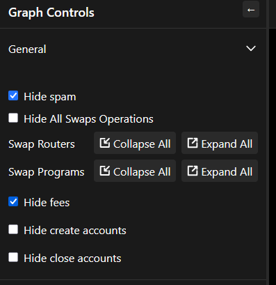

The General section offers some general options to hide/show certain types of Nodes/Links in the graph.

###### Hide Spam
By default the system doesn't hide spam transactions.
Hiding spam may result in an empty graph if all transactions are spam!

Here is the difference for the same wallet:
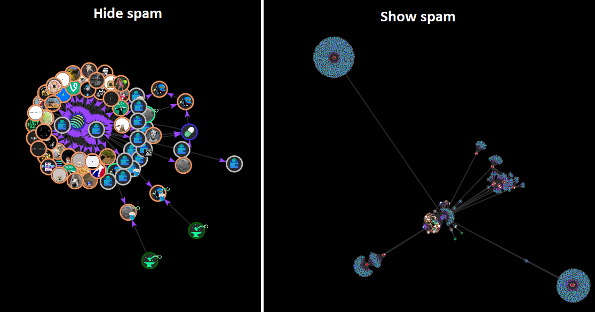

###### Swap Routers
Swap Routing operations can sometimes represent complex graph structures.
While being interesting they might not always be relevant for forensic analysis.
Swap routing operations are collapsed by default, offering a better view of what's happening without encumbering the view.

It's possible to expand a swap route by right-clicking on the program's node with the "Expand Swap Program" option.
Or Collapse/Expand all swap routers using the controls in the left panel.

Here is the same transaction (3vzGCmAaLkCBMm2Yk6jNyyWeApcd7YBevTRwWKEUeRZG2KeVYw3NE3pmMBbzY7CMqEZf9MgPJG8qXbHzdqC5A8iu) with swap routers collapsed and expanded.
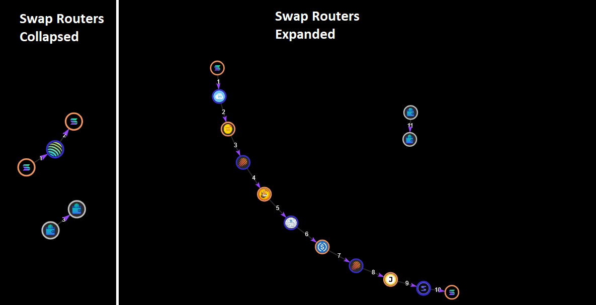

###### Swap Programs
The same way as swap router "Collapse/Expand", you can control normal swap operations too using either right-clicking a node then "Expand Swap Program" or by using the left panel controls.

Here is the same transaction with both Swap Routers and Swap Programs Expanded
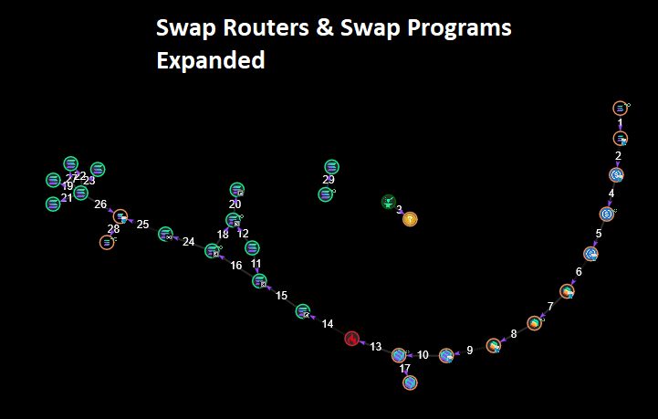

###### Other Options
Some other useful options to Hide/Show fees, Create & Close Accounts transfers.

#### Filters
The Filters section adds some simple filtering options to the graph.

##### Filter by Date & Time
You can filter transfers by time using minimum and maximum datetime.

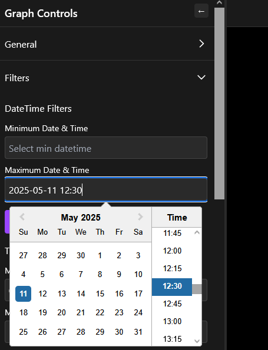

##### Filter by Accounts Addresses
You can filter transfers by the account addresses involved.
Set up a list of addresses by entering them one by one in the input field and clicking "Add" or just press the Enter key.

Remove addresses from the filter's list with the cross icon.

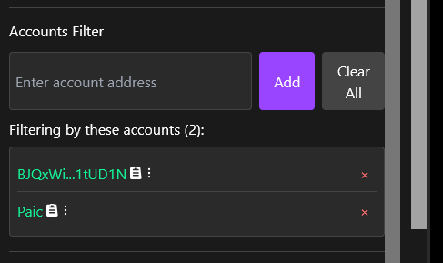

##### Filter by Amounts
You can filter transfers by the amounts involved.
3 different ways of filtering: 
 - by SOL
 - by amount of Tokens
 - by USD value (if available)

 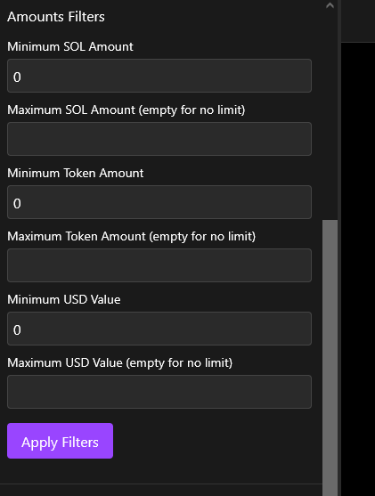

##### Transactions Clusters
Each transaction is mapped into a [NetworkX](https://networkx.org/) graph.
When fetching graph data for an account address, the engine is going to compare all the generated graphs of each transaction together using an [isomorphism algorithm](https://networkx.org/documentation/stable/reference/algorithms/isomorphism.html).
Two graphs are considered isomorphic if they share the same shape of nodes and links.
So this is ideal to detect lookalike frequent transactions that repeat the same pattern.

This control panel offers the possibility to only show transactions belonging to a certain detected cluster.

Here we can see an example where the engine grouped these 26 transactions together in the same Cluster Group number 2.
These are actual spam transactions.

Be careful of the other filters activated as you might get an empty graph. Here I had to disable "Hide Spam" to actually see them.
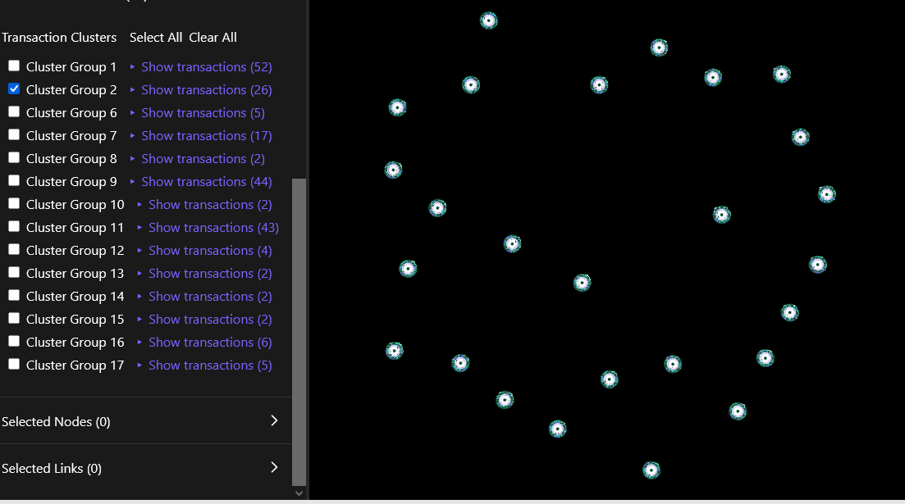

##### Selected Contextual Info
It's possible to select one or many Nodes / Links in the graph by clicking on them.
Multiple selecting is done while holding CTRL key.

Information related to the selected entities will show up in the control panel under the relevant section:
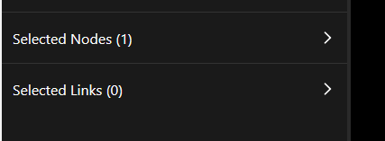

Here the central node of this little cluster of spam transfers has been selected:

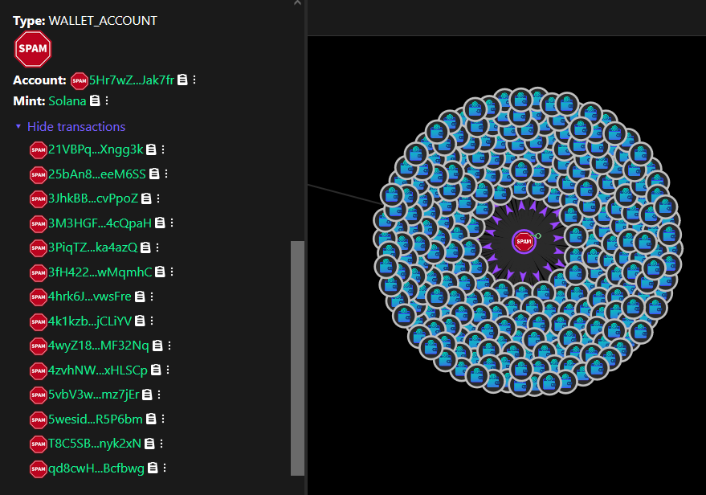

#### The View System
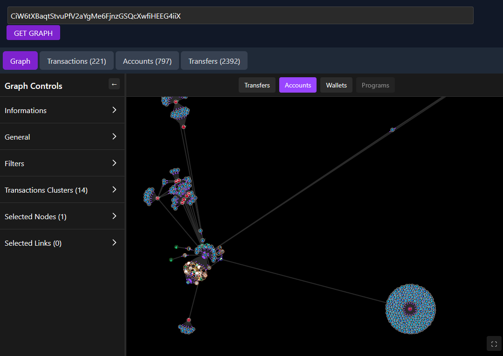

The View System offers 3 ways to look at the transaction data.

It's important to note that each view has its own "Graph Controls" panel. Filters set in one view only apply to this particular view.

The 3 different views offer different use cases depending on your needs.

Let's take an example with this transaction that covers a lot of use cases.
It's an arbitrage WSOL->WSOL :
```
39RqjuEJ4FebTht5zwiEG1qabTfFYmb9axMKUX9PpwvMpdZDJDq5CjejYSBHdSdzYhfJeBpNzhaWNCYNKPW9RTxE
```

##### Transfers View
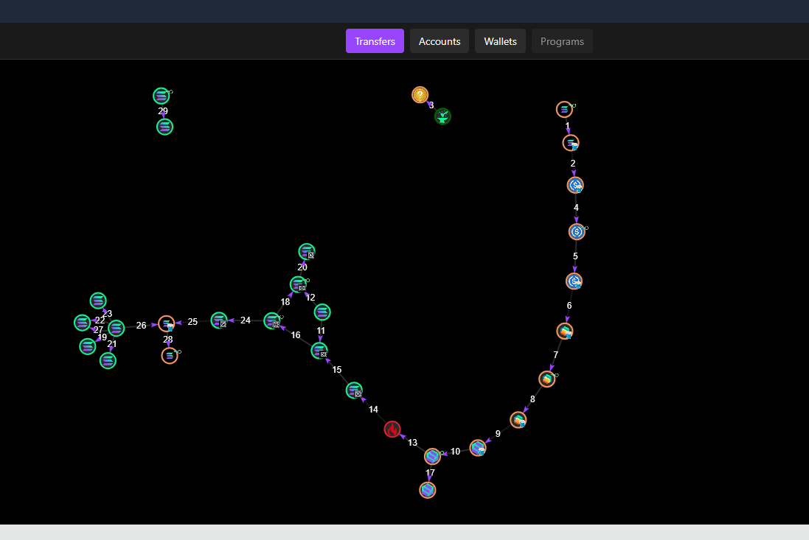

This is a Transfers Centric view.

Each transaction has its transfers mapped using a Directed Acyclic Graph by versioning accounts to avoid cycles and offers a clear sequential view of the transfers executed by the transaction.
Each link is a transfer and the number represents its order in the sequence.

Each transaction will have its nodes grouped together.
All transactions will appear as a grid pattern with the transactions being ordered by their timestamp starting from top left to bottom right.

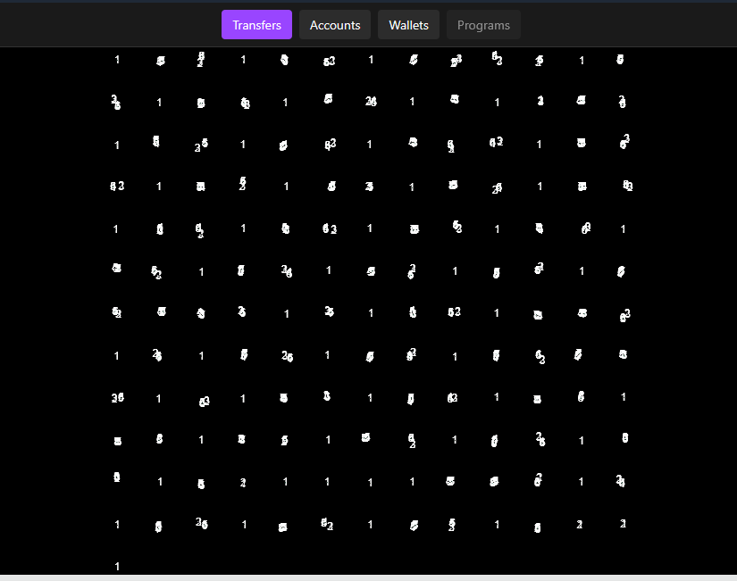

##### Accounts View
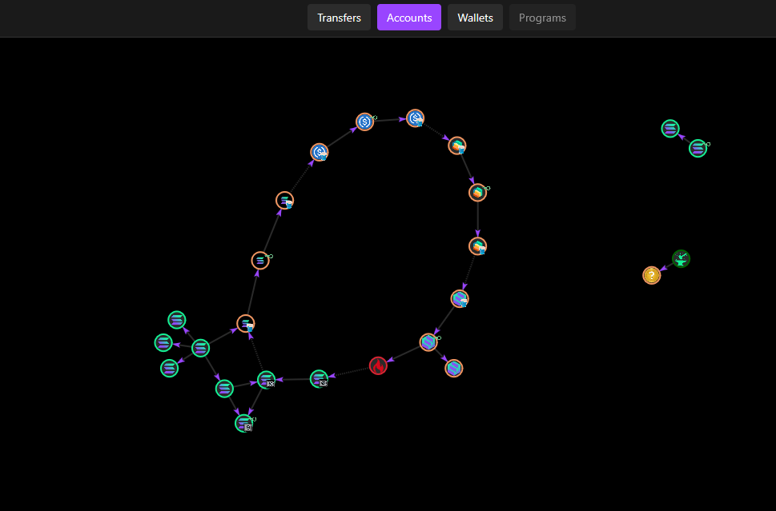

This is an Accounts Centric view.

Contrary to the Transfers View where accounts can appear multiple times in one graph, here each node is unique. So cycles appear and we can clearly recognize an arbitrage here.

As multiple transfers between the same two accounts can happen, they are aggregated but still appear while hovering a link in the "composites" section.
Example here with a transfer fee aggregating both the FEE and PRIORITY FEE transfers:

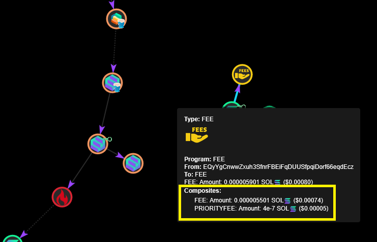

##### Wallets View
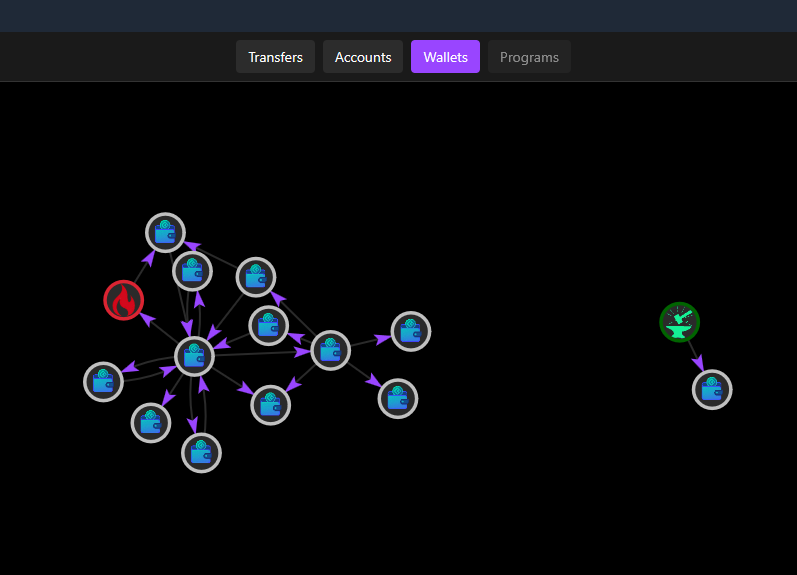
This is a Wallet Centric View.

Here Token accounts are aggregated behind the wallets they belong to.
This allows for an even more simplified view best for showcasing the relationships between the actual wallets owning these accounts.

As many token accounts can be "hidden" behind a wallet in this view, we can still see them by hovering a node, or selecting the wallet by clicking on it and looking in the "Selected Nodes" panel:

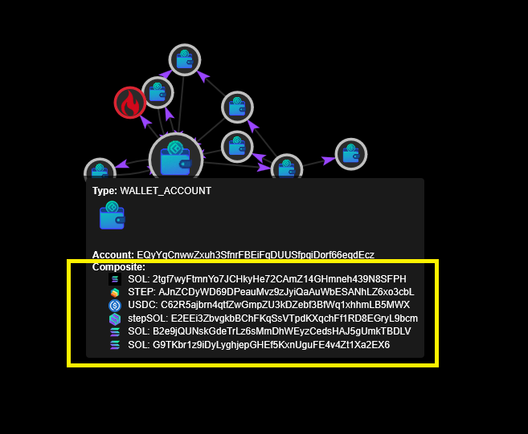

### Transfers Detection
The transaction parser is able to detect a variety of transfer types by [parsing its instructions](GrafolanaBack/domain/transaction/parsers/instruction_parsers.py).
In Solana, it's possible to transfer tokens using multiple different instructions.

In this section we cover all the possible transfers you'll be able to find using this app.

#### Normal Transfers
These are the "go-to" instructions to transfer SOL or SPL Tokens.

System Program's instructions:
    - transfer

Token Program's instructions:
    - transfer
    - transferChecked

#### Creating accounts
In Solana, it's possible to transfer SOL by creating accounts.

System Program's instructions:
    - createAccountWithSeed
    - createAccount

Associated Token Account Program's instructions:
    - create
    - createIdempotent

#### Closing Accounts
Closing an account allows to collect its rent-exempt. It's also classically used to unwrap WrappedSOL. In both cases Grafolana considers this instruction as an actual transfer.
Closing an account is quite a difficult instruction to analyze as the getTransaction RPC API unfortunately won't provide the amount of lamports transferred.
The only way is to track the account's balance throughout the transaction.
It's only an estimate as Solana Programs can natively send SOL without the need to invoke any other instruction. This could result in cases where an account's balance could have been changed by a native SOL transfer before being closed, thus making the amount the transfer from closing inaccurate.

Token Program's Instruction:
    - closeAccount

#### Withdraw from Stake Accounts
Grafolana detects withdraws from stake accounts.

Stake Program's instruction:
    - withdraw

#### Splitting Stake Accounts
Grafolana detects stake accounts splitting as transfers too.

Stake Program's instruction:
    - split

#### Stake Account Ownership Reassignments
Changing an account's owner is an actual way of transferring the balance to someone else. So Grafolana considers stake accounts ownership reassignments as actual transfers.
It's done by granting the "Withdrawer" authorization to a wallet.

Stake Program's instruction:
    - authorize

#### Native Solana Transfer
As said previously, Solana allows programs to directly write data into accounts. Which means that Programs can natively send SOL without needing to invoke the System Program. 
It's quite an effective way to obfuscate SOL transfers.
The only way to detect these in a transaction is by carefully tracking the balance changes of all involved accounts and inferring possible Native SOL transfer by comparing the end result to the actual "post_balances" provided by the GetTransaction RPC API.
For now these Native Solana Transfers are NOT DETECTED but will be in future updates.

However some Native Solana Transfers are actually inferred when it comes to certain swap programs that are known for transferring SOL in such a way.
The Pump.fun program is one of them: the SELL instruction will actually send SOL back to the seller's wallet using a Native SOL transfer. In this particular case the transfer and its amount are inferred by parsing Pump.fun inner instructions.

### Swap Detection Mechanisms
#### Recognizing Swap Operations
Grafolana uses different ways to properly recognize Swap Operations.
It does so using data from a [config file](GrafolanaBack/domain/transaction/config/dex_programs/swap_programs.py).

It recognizes Swap programs by their program address.
Then recognizes its different instructions by different indicators:
    - Instruction's name
    - Instruction's discriminator
    - Number of accounts
    - The value of a certain byte in the instruction's data
    - The last byte of the instruction's data

#### Fetching The Details of a Swap Operation
Grafolana uses a heuristic approach to detect Swap operations and the amounts involved.

Relying on the classic IDL and instruction's data parsing is costly and requires a lot of reverse engineering as DEXes usually don't provide their own IDL and data structures.

So in Grafolana we decided to go for an original and way simpler method by analyzing the transfers operated by the Swap Program.
This method only requires knowing the accounts involved in the swap: the user's source/destination accounts, and the liquidity pool's source/destination accounts.

So besides the info needed to recognize a Swap instruction, adding a new swap instruction to Grafolana is quite easy as it only requires giving the index of the user and pools accounts.

Then the [Swap Resolver Service](GrafolanaBack/domain/transaction/services/swap_resolver_service.py) will leverage NetworkX capabilities to infer the correct swap's amounts.

### Price Derivation System
Estimating the USD price of any given SPL token at any given timestamp is quite a hard problem. Especially without paying for a reliable data source.
In order to give an estimated USD price for SPL token transfers, the app uses a derivation mechanism.
This derivation mechanism is based on the price's ratio of swap operations.
For the price derivation mechanism to succeed a transaction needs to have a chain of swaps (or just one) with at least one reference coin involved.
Reference coins are SOL, WSOL, USDC and USDT.
The app fetches and stores SOL prices from Binance API and stores them in the DB.
Storing SOL prices in the DB is a necessity for obvious performance issues. Otherwise each transaction processed would necessitate one Binance API call which was proven to be highly inefficient.

#### Price Updater Background Task
When deployed the app will run a background task that will constantly update the SOL prices DB.
It stores SOL prices down to the minute level for the past 4 years.
On the first deployment the price updater background task will have to populate the DB with the entire SOL price's history for the past 4 years so it takes between 5-10 minutes for the app to be ready.
Each subsequent deployment will just have to catch up which will just take a couple of seconds.

### Labelling Entities
Grafolana offers an extended labelling system.

Grafolana will always try its best to label addresses.
It will do so depending on its type: Mint, Wallet, Program, etc.

System Programs and most DEXes are already defined and their label will show up instead of their address.
Example here with Jupiter Aggregator program address:
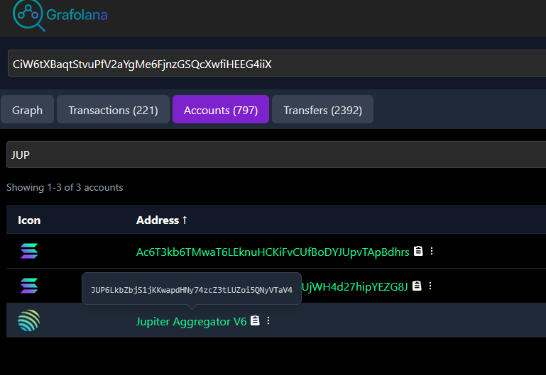

Connected users are able to define their own label by renaming any addresses they want in the app.
They can do so either by using the 3 dots menu on any addresses and selecting the "Rename Address" menu option.
Or by right-clicking on any node in the Graph and selecting the "Rename Account" menu option.

User defined labels will only show up to that specific user.

### Spam Detection
Grafolana maintains a list of known Spam addresses.
We also call this "Account dusting".

Some entities will spam your wallet by sending very small amounts of SOL/Token to your wallet.
These transfers will then show up in your wallet's transactions. 
The signers of these transactions often use a SOL Domain Name which will appear along with the transaction. 
This is the blockchain equivalent of e-mail spam.

They often clutter the user's wallet by adding a lot of useless transactions.

Grafolana will hide these transactions by default using its maintained list of known spam addresses.

You can decide to show these transactions by unchecking the "Hide spam" option in the "General" section of the "Graph Controls" left panel.

Spam addresses and transactions recognized as spam will have a "SPAM" marker next to them:
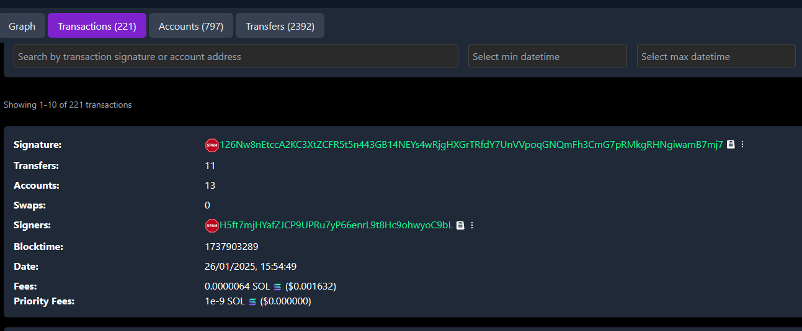

#### Mark address as spam
If you're connected to Grafolana using your wallet, you'll be able to mark addresses as spam.

There are two ways of doing so:
Either by right-clicking on a node in the graph and selecting the "Mark as spam" menu option.

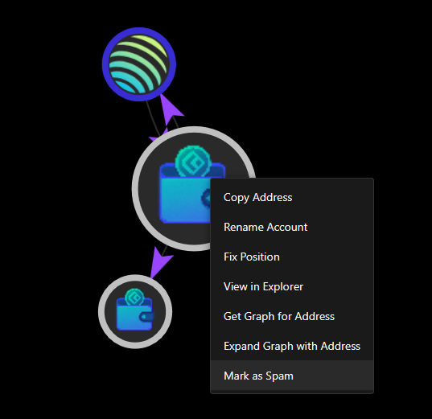

Or by using the 3 dots menu on any addresses in the app:
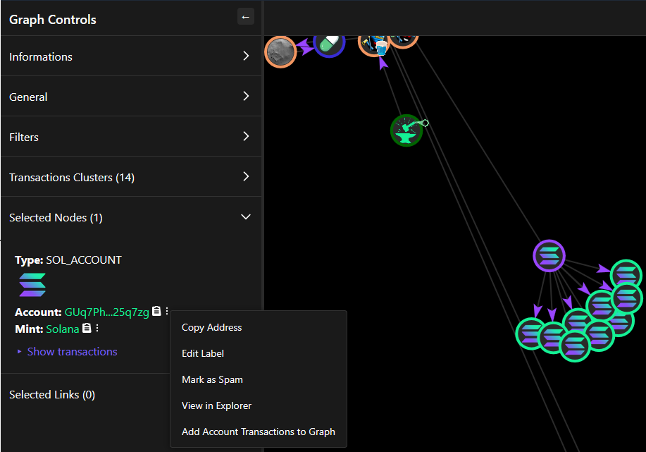

## FAQ
#### How do I add multiple transaction signatures or multiple account addresses to the graph?
3 ways of doing so:

##### From the input field
1. First load the graph with an address/signature
2. Paste the second address in the field
3. A new Button will appear: "ADD TO GRAPH"
4. Click on "ADD TO GRAPH"

In this example screenshot I added a transaction first, then pasted an account address in the input field.
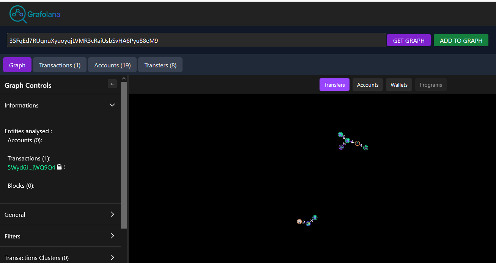

##### From the Graph
Or you can expand the graph by right-clicking on a node in the graph and clicking "Expand Graph with Address". 
This will load and analyze all transactions for this account and add the data to the actual Graph:

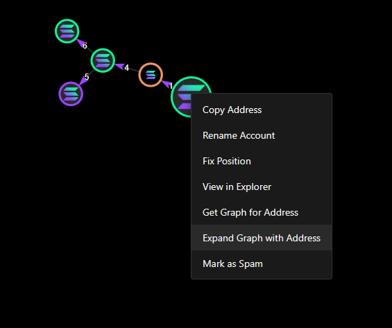

You can also use the 3 dots menu on any address in the app and clicking on "Add Account Transactions to the Graph".

#### From the 3 addresses contextual menu
Or use the "3 dots" contextual menu on any addresses in the app.

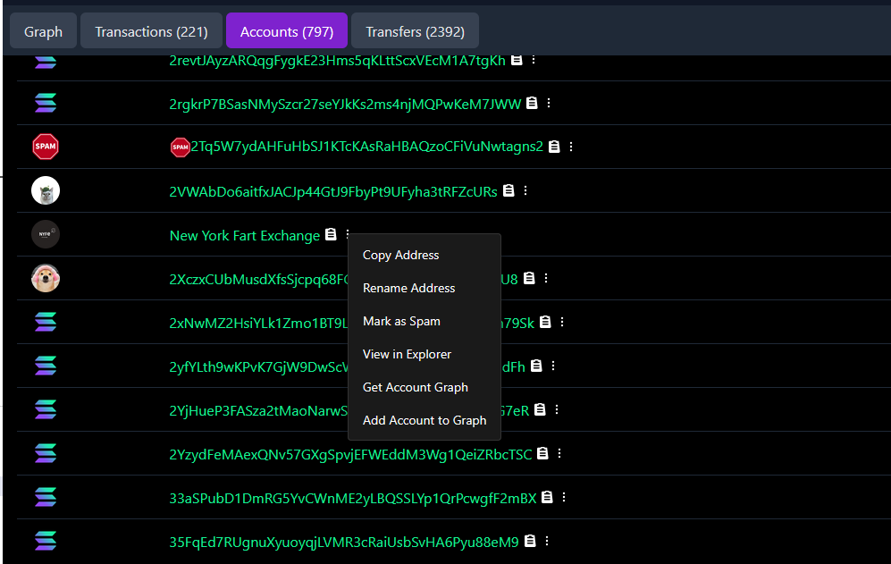

#### The graph is empty, why?
An empty graph is a graph that has no transfers to show.
Some transactions don't have any transfers associated with them and as such won't appear on the graph.

Verify your Filter's settings and Hide/Show options in the "General" control panel.

#### It takes very long to load a graph
Yes, Solana Blockchain by nature makes it difficult to analyze transaction flow.
Each transaction has to be fetched individually. Which takes time and is dependent on the RPC API endpoints rate limits you're using.
Processing the transaction data to convert them to a graph takes time too.

The current live demo (https://grafolana.com) uses 8 different free tier endpoints.

Once a transaction has been fetched, it's saved to the DB for faster retrieval.

#### I've found a bug
YES!

Please let me know by: [filling an issue](https://github.com/JulienCouzinie/Grafolana/issues/new)

## Authors
- [@JulienCouzinie](https://www.github.com/JulienCouzinie)

## Live Demo
The app is currently live and accessible running on its own dedicated server.

[Grafolana DEMO : grafolana.com](https://grafolana.com/)

## Setup and Deployment
### Prerequisites
#### Database
- PostgreSQL

You can use the [docker compose file](docker-compose.yml) to quickly spin up a PostgreSQL container.

#### Backend
- Python 3.10+
- [modules](GrafolanaBack/requirements.txt): 
   - base58==2.1.1
   - Flask==3.1.0
   - flask_Cors==5.0.0
   - Requests==2.32.3
   - solana==0.36.6
   - solders==0.26.0
   - diskcache==5.6.3
   - networkx==3.4.2
   - aiohttp==3.11.14
   - SQLAlchemy==2.0.31
   - alembic==1.13.1
   - psycopg2-binary==2.9.10
   - python-dotenv==1.1.0
   - APScheduler==3.11.0
   - Flask-Compress==1.17
   - portalocker==3.1.1

#### Frontend:
- Node.js 18+
- pnpm

## SETUP DEV
### Backend
#### Environment Variables
Database Environment Variables:
```
DB_USER=
DB_PASSWORD=
DB_HOST=
DB_PORT=
DB_NAME=
```

Flask Settings
```
FLASK_APP=app.py
FLASK_ENV=development
FLASK_DEBUG=1
```

Cache Setting (not recommended to enable cache, it's still in dev)
```
ENABLE_CACHE=false
```

By default the Flask endpoints listen on all interfaces IP addresses on port 5000.
You can specify a port with the PORT environment variable
Ex:
```
PORT=1234
```

For the CORS to work properly you need to define the accepted CORS DOMAIN.
This is the domain name and port where the front-end will be running.
Be sure to NOT include a slash '/' at the end of the URL as this could cause CORS to refuse your requests.

Example if running on local machine:

```
CORS_DOMAIN=http://localhost:3000
```

Some RPC calls use single rpc endpoint, define here your main rpc endpoint
```
SOLANA_RPC_URL=https://your.rpc-endpoint.com
```

Defining RPC endpoints for the RPC loadbalancer:
Each RPC endpoint should follow the format [URL]:[MAX-RATE-LIMIT-PER-SECOND]
Ex: 
```
HELIUS=https://mainnet.helius-rpc.com/?YOUR-HELIUS-API-KEY:5
QUICKNODE=https://YOUR-QUICKNODE-API-KEY.solana-mainnet.quiknode.pro/YOUR-QUICKNODE-API-KEY:15
ALCHEMY=https://solana-mainnet.g.alchemy.com/v2/YOUR-ALCHEMY-API-KEY:25
SYNDICA=https://solana-mainnet.api.syndica.io/api-key/YOUR-SYNDICA-API-KEY:15
CHAINSTACK=https://solana-mainnet.core.chainstack.com/YOUR-CHAINSTACK-API-KEY:2
W3NODE=https://solana.w3node.com/YOUR-W3NODE-API-KEY/api:25
PUBLICNODE=https://solana-rpc.publicnode.com:10
SHYFT=https://rpc.shyft.to?api_key=YOUR-PUBLICNODE-API-KEY:25

SOLANA_RPC_ENDPOINTS=${HELIUS},${QUICKNODE},${ALCHEMY},${SYNDICA},${CHAINSTACK},${W3NODE},${PUBLICNODE},${SHYFT}
```

Binance API URL.
The pricing system uses Binance's Kline API.
Servers located in the USA need to use the URL with ".us" domain (https://api.binance.us/api)
If you have some restrictions with the .us domain, you can use the URL with ".com" domain (https://api.binance.com/api) 
Ex:
```
BINANCE_API_URL=https://api.binance.us/api
```

You can define the vars in a .env file located at the root of the backend folder GrafolanaBack.
A .env example file is shared [here](GrafolanaBack/.env.example).


#### Installation
First set PYTHONPATH to correct Path.
The PYTHONPATH should be set to the root folder of the Grafolana Project.
```export PYTHONPATH=/f/path/to/root-folder-of-grafolana```

1. Open backend folder

```cd GrafolanaBack/```

2. Create and activate a python Virtual Environment:
```
python -m venv venv
source ./venv/Scripts/Activate
```

3. Install all required packages:
```
pip install -r requirements.txt
```

4. Start PostgreSQL using Docker:
```
cd ..
docker-compose up -d postgres
```

5. Run database migrations:
```
cd GrafolanaBack
python -m alembic upgrade head
```

### Frontend
#### Environment Variables
Define your API route to your backend server.
Ex for a local install:
```
NEXT_PUBLIC_BACKEND_URL=http://localhost:5000/api
```

You can define your Frontend env var with a .env.local file located in the GrafolanaFront folder.

You have an example [here](GrafolanaFront/.env.local.example): 

#### Installation

1. Open frontend folder
```cd GrafolanaFront```

2. Install the dependencies
```pnpm install```

3. Build the artifacts
```pnpm build```

4. Environment VAR (see at the end of this file)

## Deployment
### Backend
On the first deployment the price updater background task will need to populate the DB with SOL prices for the past 4 years down to the minute level. It takes usually between 5-10 minutes to complete. So it's recommended to wait for the task to finish before starting using the app.
On the next deployment the price updater will just have to catch up and it's going to be way faster.
```
cd GrafolanaBack
flask run --host=0.0.0.0 --no-reload --no-debug
```

### Frontend:
```
cd GrafolanaFront
pnpm start
```

## Deploying Grafolana to a Fresh Ubuntu Install

Here's a step-by-step guide to deploy Grafolana on a fresh Ubuntu installation:

### 1. System Setup

```bash
# Update system packages
sudo apt update && sudo apt upgrade -y

# Install required system dependencies
sudo apt install -y git python3-pip python3-venv nodejs npm postgresql postgresql-contrib

# Install pnpm (for frontend)
sudo npm install -g pnpm
```

### 2. Clone the Repository

```bash
# Create a directory for your application
mkdir -p ~/apps
cd ~/apps

# Clone the repository
git clone https://github.com/JulienCouzinie/Grafolana.git
cd Grafolana
```

### 3. Database Setup

```bash
# Start PostgreSQL service if not running
sudo systemctl start postgresql
sudo systemctl enable postgresql

# Create database and user
sudo -u postgres psql -c "CREATE USER grafolana WITH PASSWORD 'your_password';"
sudo -u postgres psql -c "CREATE DATABASE grafolana_db OWNER grafolana;"
sudo -u postgres psql -c "GRANT ALL PRIVILEGES ON DATABASE grafolana_db TO grafolana;"
```

### 4. Backend Setup

```bash
# Navigate to backend directory
cd ~/apps/Grafolana/GrafolanaBack

# Create and activate virtual environment
python3 -m venv venv
source venv/bin/activate

# Install dependencies
pip install -r requirements.txt

# Set PYTHONPATH
echo 'export PYTHONPATH=~/apps/Grafolana' >> ~/.bashrc
source ~/.bashrc

# Create .env file
cp .env.example .env
```

Edit the `.env` file with your configuration:
```
DB_USER=grafolana
DB_PASSWORD=your_password
DB_HOST=localhost
DB_PORT=5432
DB_NAME=grafolana_db

FLASK_APP=app.py
FLASK_ENV=production
FLASK_DEBUG=0

ENABLE_CACHE=false

CORS_DOMAIN=http://your_domain_name

SOLANA_RPC_URL=https://your.rpc-endpoint.com

# Configure RPC endpoints as per README instructions
HELIUS=https://mainnet.helius-rpc.com/?YOUR-HELIUS-API-KEY:5
# Add other RPC endpoints here
SOLANA_RPC_ENDPOINTS=${HELIUS},...

BINANCE_API_URL=https://api.binance.com/api
```

```bash
# Run database migrations
python -m alembic upgrade head

# Test if the backend starts correctly
flask run --host=0.0.0.0
```

### 5. Frontend Setup

```bash
# Navigate to frontend directory
cd ~/apps/Grafolana/GrafolanaFront

# Create .env.local file
cp .env.local.example .env.local
```

Edit the `.env.local` file:
```
NEXT_PUBLIC_BACKEND_URL=http://your_domain_name:5000/api
```

```bash
# Install dependencies
pnpm install

# Build the frontend
pnpm build
```

### 6. Setting up Services with Systemd

#### Backend Service

```bash
# Create service file for backend
sudo nano /etc/systemd/system/grafolana-backend.service
```

Add the following content:
```
[Unit]
Description=Grafolana Backend Service
After=network.target

[Service]
User=your_username
WorkingDirectory=/home/your_username/apps/Grafolana/GrafolanaBack
Environment="PYTHONPATH=/home/your_username/apps/Grafolana"
ExecStart=/home/your_username/apps/Grafolana/GrafolanaBack/venv/bin/flask run --host=0.0.0.0 --port=5000 --no-reload --no-debug
Restart=always

[Install]
WantedBy=multi-user.target
```

#### Frontend Service

```bash
# Create service file for frontend
sudo nano /etc/systemd/system/grafolana-frontend.service
```

Add the following content:
```
[Unit]
Description=Grafolana Frontend Service
After=network.target

[Service]
User=your_username
WorkingDirectory=/home/your_username/apps/Grafolana/GrafolanaFront
ExecStart=/usr/local/bin/pnpm start
Restart=always

[Install]
WantedBy=multi-user.target
```

#### Start Services

```bash
# Reload systemd, enable and start services
sudo systemctl daemon-reload
sudo systemctl enable grafolana-backend
sudo systemctl enable grafolana-frontend
sudo systemctl start grafolana-backend
sudo systemctl start grafolana-frontend

# Check status
sudo systemctl status grafolana-backend
sudo systemctl status grafolana-frontend
```

### 7. Setting up Nginx (Optional, for production)

```bash
# Install Nginx
sudo apt install -y nginx

# Create Nginx configuration
sudo nano /etc/nginx/sites-available/grafolana
```

Add the following content:
```
server {
    server_name your_domain_name;

    location / {
        proxy_pass http://127.0.0.1:3000;
        proxy_http_version 1.1;
        proxy_set_header Upgrade $http_upgrade;
        proxy_set_header Connection 'upgrade';
        proxy_set_header Host $host;
        proxy_cache_bypass $http_upgrade;
    }

    location /api {
        proxy_pass http://127.0.0.1:5000/api;
        proxy_http_version 1.1;
        proxy_set_header Upgrade $http_upgrade;
        proxy_set_header Connection 'upgrade';
        proxy_set_header Host $host;
        proxy_cache_bypass $http_upgrade;
        proxy_connect_timeout 300s;
        proxy_send_timeout 300s;
        proxy_read_timeout 300s;
    }

    listen 443 ssl; # managed by Certbot
    ssl_certificate /etc/letsencrypt/live/grafolana.com/fullchain.pem; # managed by Certbot
    ssl_certificate_key /etc/letsencrypt/live/grafolana.com/privkey.pem; # managed by Certbot
    include /etc/letsencrypt/options-ssl-nginx.conf; # managed by Certbot
    ssl_dhparam /etc/letsencrypt/ssl-dhparams.pem; # managed by Certbot

    proxy_connect_timeout 300s;
    proxy_send_timeout 300s;
    proxy_read_timeout 300s;
    fastcgi_send_timeout 300s;
    fastcgi_read_timeout 300s;
}
server {
    if ($host = grafolana.com) {
        return 301 https://$host$request_uri;
    } # managed by Certbot


    listen 80;
    server_name grafolana.com;
    return 404; # managed by Certbot
}
```

```bash
# Enable the site
sudo ln -s /etc/nginx/sites-available/grafolana /etc/nginx/sites-enabled/
sudo nginx -t
sudo systemctl restart nginx

# Set up SSL with Let's Encrypt (optional)
sudo apt install -y certbot python3-certbot-nginx
sudo certbot --nginx -d your_domain_name
```

### 8. Final Notes

- Replace `your_username` with your actual Ubuntu username
- Replace `your_domain_name` with your actual domain or server IP
- Replace `your_password` with a secure password
- Set up proper RPC endpoints in the backend `.env` file
- The first run will take 5-10 minutes to download and process SOL price history

**Important**: The nginx configuration uses explicit IP addresses (`127.0.0.1`) instead of `localhost` to avoid DNS resolution issues. After a system reboot, `localhost` may resolve to IPv6 `[::1]` instead of IPv4 `127.0.0.1`, causing "Connection refused" errors. Using explicit IPs ensures consistent connectivity.

You can check the application logs using:
```bash
sudo journalctl -u grafolana-backend
sudo journalctl -u grafolana-frontend
```

Your Grafolana application should now be accessible at http://your_domain_name (or https:// if you configured SSL).


### Unit Tests & Integration Test
No.

There are no tests for now. Didn't have time given the one month limit for the hackathon.
But someday...

The actual test files in the backend folders are actually just sandboxes I used throughout the development to rapidly test ideas.


## License
[MIT](https://choosealicense.com/licenses/mit/)


## Screenshots


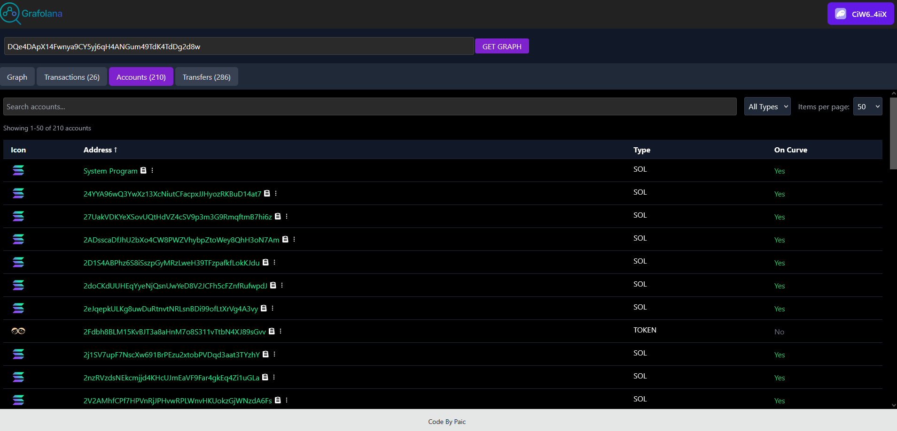
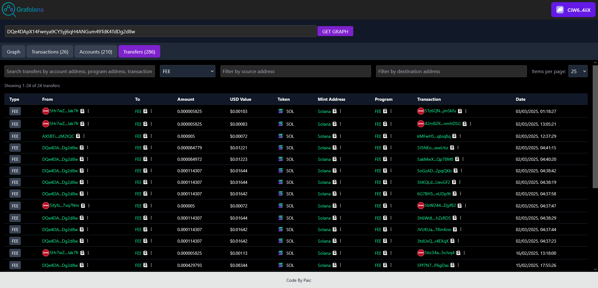


## Acknowledgements
 - [Solscan](https://solscan.io/) For providing the best Solana block explorer available. I spent hundreds of hours looking at transactions on their website. They are the best! =)
 - [NetworkX](https://networkx.org/) Brilliant Python library for handling graphs.
 - [React Force Graph](https://github.com/vasturiano/react-force-graph) Amazing React UI library to showcase graphs using [D3 Force engine](https://d3js.org/) 
 - [ClaudeAI](https://claude.ai/) For providing more code than bugs and usually fixing them.
 - [ChatGPT](https://chatgpt.com/) For providing neat graphics.
 - [Dad & Mum](https://nolink.io) For the non-stop support they gave me while I binge coded this app.


## Buy Me A Coffee ☕ !

Feel like contributing or just want to pay me a coffee?!
Donations accepted here: CiW6tXBaqtStvuPfV2aYgMe6FjnzGSQcXwfiHEEG4iiX