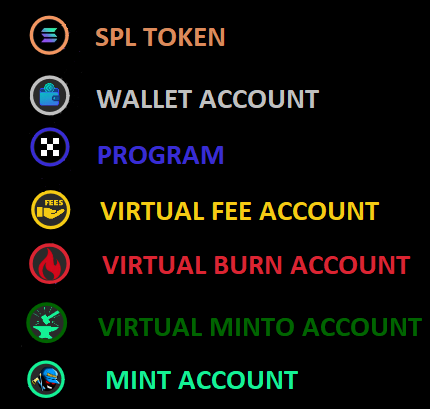
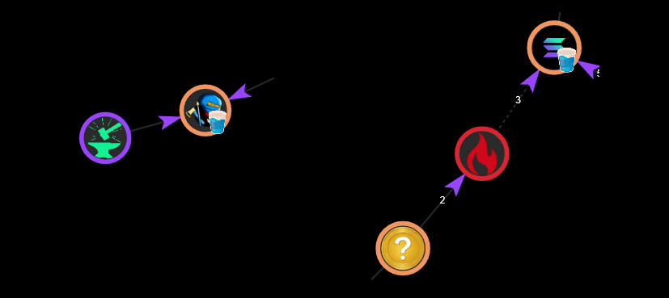
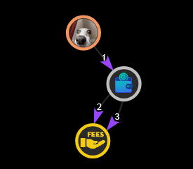
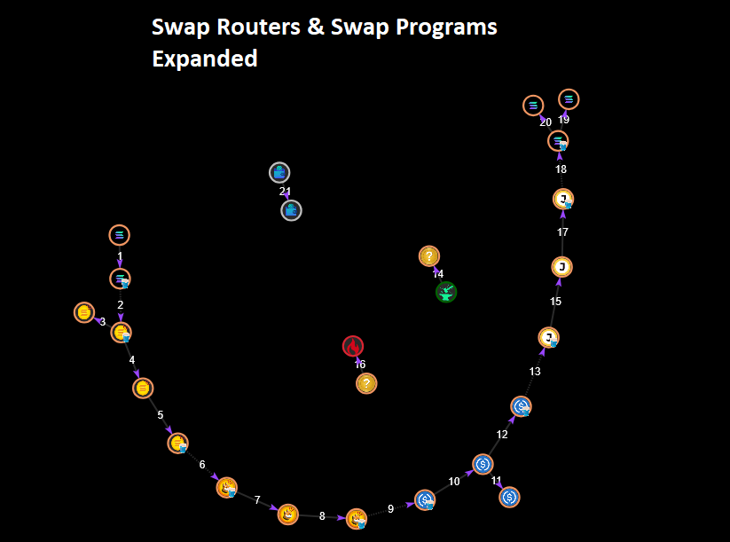
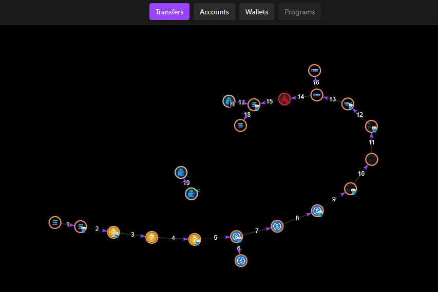
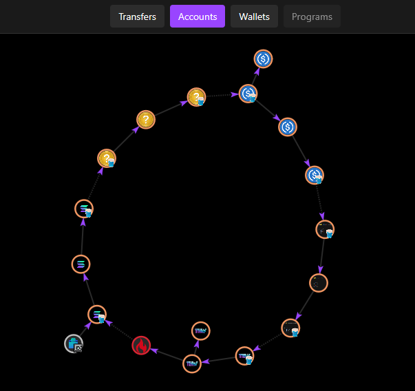

# Grafolana

Grafolana is a Forensic Analysis Tool for the Solana ecosystem.
It provides with precise tracking and visualization of on-chain fund movements using a graph based approach.

Designed with two core principles: simplicity and independence. Our forensic analysis tool delivers powerful transaction visualization through elegant graph interfaces and intuitive views, all without registration barriers. We leverage only native Solana RPC capabilities—no costly commercial APIs required. Maximum insight, minimum overhead.

Developed for the [Helius REDACTED hackaton](https://earn.superteam.fun/hackathon/redacted/) in the [Solana Forensic Analysis Tool Category](https://earn.superteam.fun/listing/solana-forensic-analysis-tool/)


## Features

### Backend
- [Creates graph based on transaction datas](GrafolanaBack/domain/transaction)
- Retrieve graph data for transactions signatures
- Retrieve graph data for the last 1000 transactions of an account address
- Create Directed Acyclic Graph of each transaction by versionning accounts to avoid cycles and offers graphic sequential view of transfers
- Recognizes 144 differents swap instructions from 59 differents [DEX programs](GrafolanaBack/domain/transaction/config/dex_programs/swap_programs.py)
- Map transfers by parsing 20 differents [instructions](GrafolanaBack/domain/transaction/parsers/instruction_parsers.py) from Solana's Built in programs
- Native SOL transfer inference (Ex: Pumpfun Sell operations)
- Offers [3 differents graph's views](GrafolanaFront/src/components/grafolio/graph/view-strategies): Transers, Accounts and Wallets
- Stores minimum 4 years worth of SOL prices in DB for quick lookup and updates every minutes
- [USD prices](GrafolanaBack/domain/prices) derivation mechanism for SPL token using swap's datas and Binance API for SOL prices
- Transactions Clustering algorithm that groups transactions by their graph's shape
- [Fast & Failsafe RPC transactions batching](GrafolanaBack/domain/rpc/rpc_acync_transaction_fetcher.py) using multiple RPC enpoints with loadbalancer respecting rate limits
- [Metadata retrieval system](GrafolanaBack/domain/metadata/spl_token) for SPL tokens mints
- Storage of transactions and mint metadata in Database for fast retrieval
- [Labelling system](GrafolanaBack/domain/metadata/labeling) allowing users to edit labels for any address
- Solana [System's Programs and Swap Programs Medadata](GrafolanaBack/domain/metadata/program)
- [Spam (dusting) detection system](GrafolanaBack/domain/spam) using default address blacklist in database, user can mark address as spam

### UI Graph
- Unique field for loading graph data by transaction signatures or addresses
- Add multiple addresses/transactions to the same graph
- Interactive graph UI with right click context menu actions: copy address/rename/mark as spam/fix position
- "Address Label" component allowing to show addresses and interact with them
- Expand/Collapse swaps & swap routers transfers
- Hide/Show swaps operations
- Hide/Show spam transfers
- Hide/Show fee transfers
- Hide/Show of Create/Close accounts transfers
- Filters by amounts :SOL/SPL Token/USD Value
- Transactions clusters: Show specifics group of "lookalike" transactions 
- Contextual informations of selected nodes/links
- Select multiple Nodes while holding CTRL key
- Drag & Fix a node position by draging a node while holding ALT key
- Fullscreen mode

### UI Lists
- List of Transactions
- List of Accounts
- List of Transfers

### The Graph 
#### Legend
Legend of the differents colors used for drawing nodes:



#### Indicators
Some little icons serves as indicator for some contextual node's info.
We have Signer indicator for accounts that have signed transactions.
A pool icon to showcase the swap's liquidity pools.
A stake icon for .. stake accounts !


### Design Choices: Virtual Links & Nodes
#### Swaps


When swaps are recognized by the system a virtual swap transfer representing the swap is added to the graph.
It allows to connect accounts together by this programmatic relationship.

I decided to connect the pools accounts used by the swaps as it "fills the gap" created in the flow:

User source account -> Pool 1 [GAP] Pool 2 -> User destination accounts

This is purely a technical choice to allow to link nodes and show a consolidated view of the flow and does not represents an actual transfer.

#### Burn & MintTo

Burn & Minto will appear as actual transfer leading or pointing to a virtual account that represents either its destination: burn or its source: mintto.

These nodes don't represents actual accounts and are just used to get a better view of what's happening while sticking to the graph's nodes/links concepts.

As detailed in the screenshot here, a virtual burn account might be used as a swap source account when the swap requires burning some token: here its a Sanctum's PrefundWithdrawStake.

#### Fees

Fees paid during a transaction are shown as actual transfers, both regular and priority fees.
To be able to stay consistent with the graph Node/Link pattern I decided to create virtual Fee accounts.
Hovering a fee account will show the total fee. 
In Transfer View, each fee account is tied to a transaction and will only show total fees for that transaction.
In Accounts and Wallets Views: If multiple transaction are loaded in the graph the fee account will show the total fees of all the transactions.

## Graph Controls

The left panels offers contextual informations and some options to control the graph.

### General Options

The General section offers some general options to hide/show certain types of Nodes/Links in the graph.

#### Hide Spam
By default the system Hides spam transaction.
Hiding spam may result in an empty graph if all transactions are spam !

Here is the difference for the same wallet:


#### Swap Routers
Swaps Routing operation can sometimes represents complex graph structure.
While being interesting they might not be always relevant for forensic analysis.
Swap routing operating are collapsed by default, offering a better view of what's happening without encombering the view.

It's possible to expand a swap router by right-clicking on the program's node with the "Expand Swap Program" option.
Or Collapse/Expand all swaps router using the controls in the left panel.

Here is the same transaction (3vzGCmAaLkCBMm2Yk6jNyyWeApcd7YBevTRwWKEUeRZG2KeVYw3NE3pmMBbzY7CMqEZf9MgPJG8qXbHzdqC5A8iu) with swap routers collapsed and expanded.


#### Swap Programs
The same way as swap router "Collapse/Expand", you can control normal swap operation too using either right-clicking a node then "Expand Swap Program" or by using the left panel controls.

Here is the same transaction with both Swap Routers and Swap Programs Expanded



#### Other Options
Some other usefull options to Hide/Show fees, Create & Close Accounts transfers.

Fees are hidden by default to help with clarity.

## Transactions Clusters

Each transaction is mapped into a [NetworkX](https://networkx.org/) graph.
When fetching graph data for an account address, the engine is going to compare all the generated graph of each transactions together using an [isomorphism algorithm](https://networkx.org/documentation/stable/reference/algorithms/isomorphism.html).
Two graph are considered isomorphic if they share the same shape of nodes and link.
So this is ideal to detect lookalike frequent transactions that repeat the same pattern.

This control panel offers the possibility to only show transactions belonging to a certain detected cluster.

Here we can see an example where the engine grouped these 26 transactions together in the same Cluster Group number 2.
These are actual spam transactions.

Be carefull of the other filters activated as you might get an empty graph. Here I had to disable "Hide Spam" to actually see them.


## Selected Contextual Infos
It's possible to select one or many Nodes / Links in the graph by clicking on them.
Multiple selecting is done while holding CTRL key.

Informations related to the selected entities will show up in the control panel under the relevant section:


Here the central node of this little cluster of spam transfers has been selected:


## The View System


The View System offers 3 ways to look at the transactions datas.

It's important to note that each view has its own "Graph Controls" panel. Filters set in one view only apply to this particular view.

The 3 differents views offer different use cases depending on your needs.

Let's take an example with this transaction that covers a lot of use cases.
It's an arbitrage WSOL->WSOL :
```
3vzGCmAaLkCBMm2Yk6jNyyWeApcd7YBevTRwWKEUeRZG2KeVYw3NE3pmMBbzY7CMqEZf9MgPJG8qXbHzdqC5A8iu
```

### Transfers View

This is a Transfers Centric view.

Each transaction has it's transfers mapped as Directed Acyclic Graph by versionning accounts to avoid cycles and offers a clear sequential view of the transfers executed by the transaction.
Each link is a transfer and the number represents its order in the sequence.

### Accounts View

This is an Accounts Centric view.

Contrary to the Transfers View where accounts can appear multiple time in one graph here each node is unique. So cycles appear and we can clearly recognize an arbitrage here.

As mutliples transfer between the same two accounts can happen, they are aggretated but still appear while hovering a link in the "composites" section.
Example here with a transfer fee aggreting both the FEE and PRIORITY FEE transfers:


### Wallets View

This is a Wallet Centric View.

Here Token accounts are aggregated behind the wallet's they belongs to.
This allow for an even more simplified view best for showcasing the relation between the actual wallets owning these accounts.

As many token accounts can be "hidden" behing a wallet in this view, we can still see them by hoving a node :


## Price Derivation System

Estimating the USD price of any given SPL token at any given timestamp is quite a hard problem. Especially without paying for a reliable data source.
In order to give an estimate USD price for SPL token transfers, the app uses a derivation mechanism.
This derivation mechanism is based on the price's ratio of swap operations.
For the price derivation mechanism to succeed a transaction needs to have a chain of swaps (or just one) with at least one reference coin involved.
Reference coins are SOL, WSOL, USDC and USDT.
The app fetches and stores SOL prices from binance API and stores them in the DB.
Storing SOL prices in the DB is a necessity for obvious performances issues. Otherwise each transaction processed would necessitate one Binance API call which was proven to be highly inefficient.

### Price Updater Background Task

When deployed the app will run a background task that will constantly updates the SOL prices DB.
It stores SOL prices down to the minute level for the past 4 years.
On the first deployment the price updater background task will have to populate the DB with the entire SOL price's history for the past 4 years so it takes between 5-10 minutes for the app to be ready.
Each subsequent deployments will just have to catch up which will just takes a couple of seconds.


## FAQ

#### How do I add multiples transactions signatures/address to the graph?

1. First load the graph with an address/signature
2. Paste the second address in the field
3. A new Button will appear: "ADD TO GRAPH"
4. Click on "ADD TO GRAPH"

#### The graph is empty, why ?

An empty graph is a graph that has no transfers to show.
Some transactions don't have any transfers associated to them and as such won't appear on the graph.

Verify your Filter's settings and Hide/Show options in the "General" control panel.

#### It takes very long to load a graph

Yes, Solana Blockchain by nature makes it difficult to analyse transactions flow.
Each transactions has to be fetched individually. Which takes time and is dependent on the RPC API endpoints rates limits you're using.
Processing the transactions data to convert them to a graph takes time too.

The current live demo (https://grafolana.vercel.app/) uses 8 differents free tiers endpoints giving an average processing rate of 30 transactions per seconds.

Once a transaction has been fetched, it's save to the DB for faster retrieval

#### I've found a bug

YES !

Please let me know by : [filling an issue](https://github.com/JulienCouzinie/Grafolana/issues/new)


## Authors

- [@JulienCouzinie](https://www.github.com/JulienCouzinie)


## Demo
The app is currently live and accessible running on [Vercel](https://vercel.com) and its backend hosted by [Render](https://render.com/)

Due to current limitation of the free tiers used with Render, you might experience some lag occasionally as Render will spin down inactive app after a while which can delay requests by 50 seconds or more.

The app is accessible here 
[Grafolana DEMO : grafolana.vercel.app](https://grafolana.vercel.app/)


## Setup and Deployment

### Prerequisites

#### Database
- PostgreSQL

You can use the [docker compose file](docker-compose.yml) to quickly spin up a PostgreSQL container.

#### Backend
- Python 3.10+
- [modules](GrafolanaBack/requirements.txt): 
   - base58==2.1.1
   - Flask==3.1.0
   - flask_Cors==5.0.0
   - Requests==2.32.3
   - solana==0.36.6
   - solders==0.26.0
   - diskcache==5.6.3
   - networkx==3.4.2
   - aiohttp==3.11.14
   - SQLAlchemy==2.0.31
   - alembic==1.13.1
   - psycopg2-binary==2.9.10
   - python-dotenv==1.1.0
   - APScheduler==3.11.0
   - Flask-Compress==1.17
   - portalocker==3.1.1

### Front:
- Node.js 18+
- pnpm

## SETUP
#### Backend
##### Environment Variables

Database Environment Variables :
```
DB_USER=
DB_PASSWORD=
DB_HOST=
DB_PORT=
DB_NAME=
```

Flask Settings
```
FLASK_APP=app.py
FLASK_ENV=development
FLASK_DEBUG=1
```

Cache Setting (not recommended to enable cache, it's still in dev)
```
ENABLE_CACHE=false
```

By default the Flask endpoints listens on all interfaces ip addresses on port 5000.
You can specify a port with the PORT environnement variables
Ex:
```
PORT=1234
```

Some RPC calls uses single rpc endpoint, define here your main rpc endpoint
```
SOLANA_RPC_URL=https://your.rpc-endpoint.com
```

Defining RPC endpoints for the RPC loadbalancer:
Each RPC endpoint should follow the format [URL]:[MAX-RATE-LIMIT-PER-SECOND]
Ex: 
```
HELIUS=https://mainnet.helius-rpc.com/?YOUR-HELIUS-API-KEY:5
QUICKNODE=https://YOUR-QUICKNODE-API-KEY.solana-mainnet.quiknode.pro/237ced2cfac7e190db7119d5536660c71b57de48:15
ALCHEMY=https://solana-mainnet.g.alchemy.com/v2/YOUR-ALCHEMY-API-KEY:25
SYNDICA=https://solana-mainnet.api.syndica.io/api-key/YOUR-SYNDICA-API-KEY:15
CHAINSTACK=https://solana-mainnet.core.chainstack.com/YOUR-CHAINSTACK-API-KEY:2
W3NODE=https://solana.w3node.com/YOUR-W3NODE-API-KEY/api:25
PUBLICNODE=https://solana-rpc.publicnode.com:10,https://rpc.shyft.to?api_key=YOUR-PUBLICNODE-API-KEY:25

SOLANA_RPC_ENDPOINTS=${HELIUS},${QUICKNODE},${ALCHEMY},${SYNDICA},${CHAINSTACK},${W3NODE},${PUBLICNODE}
```

##### Installation
    First set PYTHONPATH to correct Path
    ```export PYTHONPATH=/f/Développement/Python/Grafolana```

    1. Open backend folder

    ```cd GrafolanaBack/```

    2. Create and activate a python Virtual Environment:
    ```
    python -m venv venv
    source ./venv/Scripts/Activate
    ```

    3. Install all required packages:
    ```
    pip install -r requirements.txt
    ```

    4. Start PostgreSQL using Docker:
    ```
    cd ..
    docker-compose up -d postgres
    ```

    5. Run database migrations:
    ```
    cd GrafolanaBack
    python -m alembic upgrade head
    ```

#### Frontend
##### Environment Variables
Define your API route to your backend server.
Ex for a local install:
```
NEXT_PUBLIC_BACKEND_URL=http://localhost:5000/api
```

##### Installation

    1. Open frontend folder
    cd GrafolanaFront

    2. Install the dependencies
    pnpm install

    3. Build the artifacts
    pnpm build

    4. Environement VAR (see at the end of this file)


#### Deployment
##### Backend
On the first deployment the price updater background task will need to populate the DB with SOL prices for the past 4 years down to the minute level. It takes usually between 5-10 minutes to complete. So it's recommended to wait for the task to finish before starting using the app.
On the next deployment the price updater will just have to catch up and it's going to be way faster.
```
cd GrafolanaBack
flask run --host=0.0.0.0 --no-reload --no-debug
```

##### Frontend:
```
cd GrafolanaFront
pnpm start
```


## Unit Tests & Integration Test

No.

There are no tests for now. Didn't have time given the one month limit for the hackaton.
But someday...

The actual tests files in the backend folders are actually just sandboxes I used throughout the developement to rapidly test ideas.


## License
[MIT](https://choosealicense.com/licenses/mit/)


## Screenshots


## Acknowledgements

 - [Solscan](https://solscan.io/) For providing the best Solana block explorer available. I spent hundreds hours lookings at transactions on their website. They are the best ! =)
 - [NetworkX](https://networkx.org/) Brilliant Python library for handling graph.
 - [React Force Graph](https://github.com/vasturiano/react-force-graph) Amazing React UI library to showcase graph using [D3 Force engine](https://d3js.org/) 
 - [ClaudeAI](https://claude.ai/) For providing more codes than bugs and usually fixing them.
 - [ChatGPT](https://chatgpt.com/) For providing neat graphics.
 - [Dad & Mum](https://nolink.io) For the non-stop support they gave me while I binge coded this app.


## Buy Me A Coffee ☕ !

Feel like contributing or just want to pay me a coffee ?!
Donations accepted here CiW6tXBaqtStvuPfV2aYgMe6FjnzGSQcXwfiHEEG4iiX 